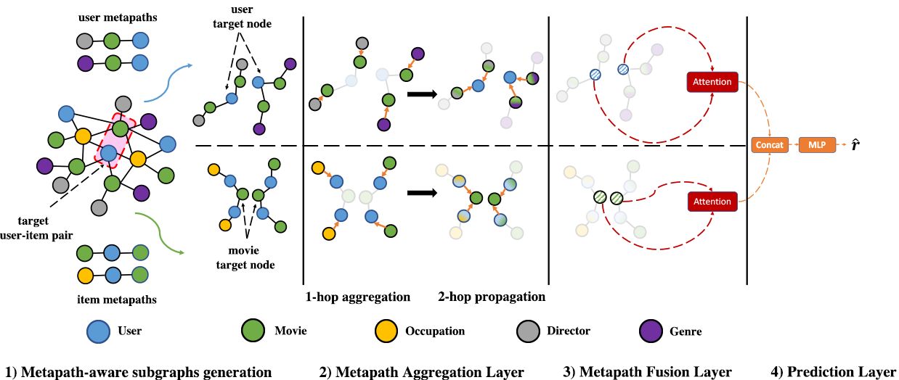
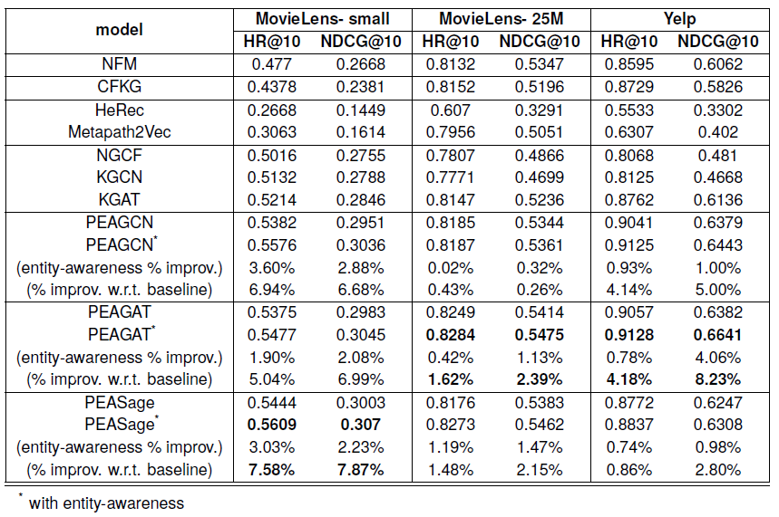

# Metapath- and Entity-aware Graph Neural Network for Recommendation
## Code is available

## Introduction

Integrating content information for user preference prediction remains a challenging task in the development of recommender systems.
Due to the shallow structure, classic graph neural networks (GNNs) failed in modelling high-order graph structures that deliver critical insights of task relevant relations.
A natural solution of capturing the inter- and intra-relations between content features and user-item pairs is to explore the high-order information encoded by metapaths, a set of composite relations designed for representing multi-hop structure and sequential semantics.

<!-- 

 --> 

## PEAGNN Framework 



We propose Meta Path- and Entity-Aware Graph Neural Network (PEAGNN), a unified GNN framework tailored for recommendation tasks, which is capable of exploiting the rich semantics in metapaths. PEAGNN trains multilayer GNNs to perform metapath-aware information aggregation on collaborative subgraphs, h-hop subgraphs around the target user-item pairs. After the attentive fusion of aggregated information from different metapaths, a graph-level representation is then extracted for matching score prediction. To leverage the local structure of collaborative subgraphs, we present entity-awareness that regularizes node embedding with the presence of features in a contrastive manner. Further analysis indicates that trained PEAGNN automatically derives meaningful metapath combinations from the given metapaths.

## Results
Our model is able to outperform the other competitive baselines on three public datasets, namely: MovieLens-small, MovieLens-25M and Yelp. We use Hit Ratio (HR) and Normalized Discounted Cumulative Gain (NDCG) metrics.
The performances of PEAGNN variants and baselines are presented below:


## Requirements and Installation
* Python 3.6
* [PyTorch](http://pytorch.org/) 1.5.1
* [PyTorch Geometric](https://github.com/rusty1s/pytorch_geometric) 1.5.0
* Install all dependencies run
```
pip3 install -r requirements.txt
```
* our code can be installed by
```
python3 setup.py install
```

## Directory structure

The basic skeleton of our source code will look like this :
```bash

├── datasets
│   └── Yelp
│      └──  yelp_dataset.tar
├── experiments
│   ├── checkpoint
│   │   ├── data
│   │   │   ├── Movielenslatest-small
│   │   │   ├── Movielenslatest-25m
│   │   │   └── Yelp
│   │   ├── loggers
│   │   │   ├── Movielenslatest-small
│   │   │   ├── Movielenslatest-25m
│   │   │   └── Yelp
│   │   └── weights
│   │       ├── Movielenslatest-small
│   │       ├── Movielenslatest-25m
│   │       └── Yelp
│   ├── scripts
│   │   ├── **/*.ps1
│   └── **/*.py
├── graph_recsys_benchmark
│   ├── datasets
│   │   ├── **/*.py
│   ├── models
│   │   ├── **/*.py
│   ├── nn
│   │   ├── **/*.py
│   ├── parser
│   │   ├── **/*.py
│   ├── utils
│   │   ├── **/*.py
│   └── **/*.py
├── images
│   └── **/*.png
├── license.txt
├── README.md
├── requirements.txt
└── setup.py
```

## Description of the Code
The code is based on [PyTorch Geometric](https://github.com/rusty1s/pytorch_geometric) documentation. 

- [`experiments`](experiments): contain experiment files for PEAGNN and baseline models
- [`checkpoint`](experiments/checkpoint): contain processed data, logs and model weights
- [`scripts`](experiments/scripts): scripts to reproduce the results for each dataset
- [`datasets`](graph_recsys_benchmark/datasets): creates Heterogenous Information network for the datasets
- [`models`](graph_recsys_benchmark/models): creates PEAGNN and baseline models 
- [`nn`](graph_recsys_benchmark/nn): contains convolutional networks for GNN based models
- [`parser`](graph_recsys_benchmark/parser): functions to parse the raw dataset files
- [`utils`](graph_recsys_benchmark/utils): functions to save, load models and compute evaluation metrics

## Running the experiments 

### Download the datasets
#### MovieLens dataset

Dataset will be downloaded during experiment execution and saved in [``experiments/checkpoint/data``](experiments/checkpoint/data) folder. No need to explicity download the dataset. Weights of pre-trained Movielens-small dataset can be found [here](experiments/checkpoint/weights/Movielenslatest-small).

#### Yelp dataset

Download the dataset via this [link](https://www.yelp.com/dataset/download) and save ``yelp_dataset.tar``  in the ``datasets/Yelp`` folder.
Like MovieLens dataset, the extracted raw files will be saved in [``experiments/checkpoint/data``](experiments/checkpoint/data) folder during execution.

## Running the Code

For training and testing PEAGNN and baseline models, pass the appropriate arguments to the [``experiments``](experiments) files.
To reproduce the benchmark results for particular dataset, use the arguments as mentioned in [``experiments/scripts``](experiments/scripts) folder.

For instance, for training PEAGAT model on MovieLens-small dataset run the following command:

```
python3 peagat_solver_bpr.py --dataset=Movielens --dataset_name=latest-small --num_core=10 --num_feat_core=10 --sampling_strategy=unseen --entity_aware=false --dropout=0 --emb_dim=64 --repr_dim=16 --hidden_size=64 --meta_path_steps=2,2,2,2,2,2,2,2,2 --entity_aware_coff=0.1 --init_eval=true --gpu_idx=0 --runs=5 --epochs=30 --batch_size=1024 --save_every_epoch=26 --metapath_test=false
```

For instance, for training PEAGAT model with entity awareness on MovieLens-small dataset run the following command:

```
python3 peagat_solver_bpr.py --dataset=Movielens --dataset_name=latest-small --num_core=10 --num_feat_core=10 --sampling_strategy=unseen --entity_aware=true --dropout=0 --emb_dim=64 --repr_dim=16 --hidden_size=64 --meta_path_steps=2,2,2,2,2,2,2,2,2 --entity_aware_coff=0.1 --init_eval=true --gpu_idx=0 --runs=5 --epochs=30 --batch_size=1024 --save_every_epoch=26 --metapath_test=true
```

For training other baselines e.g. KGAT on MovieLens-small dataset run the following command:

```
python3 kgat_solver_bpr.py --dataset=Movielens --dataset_name=latest-small --num_core=10 --num_feat_core=10 --sampling_strategy=unseen --entity_aware=false --dropout=0.1 --emb_dim=64 --hidden_size=64 --entity_aware_coff=0.1 --init_eval=false --gpu_idx=0 --runs=5 --epochs=30 --batch_size=1024 --save_every_epoch=26
```

# Pre-Trained Models available for download
The pre-trained models for all three datasets used in this paper can be accessed via this [link](https://drive.google.com/drive/folders/1Y9sTnS_TXk3d8Hv5_I061w-iA3lmdU0e?usp=sharing).


